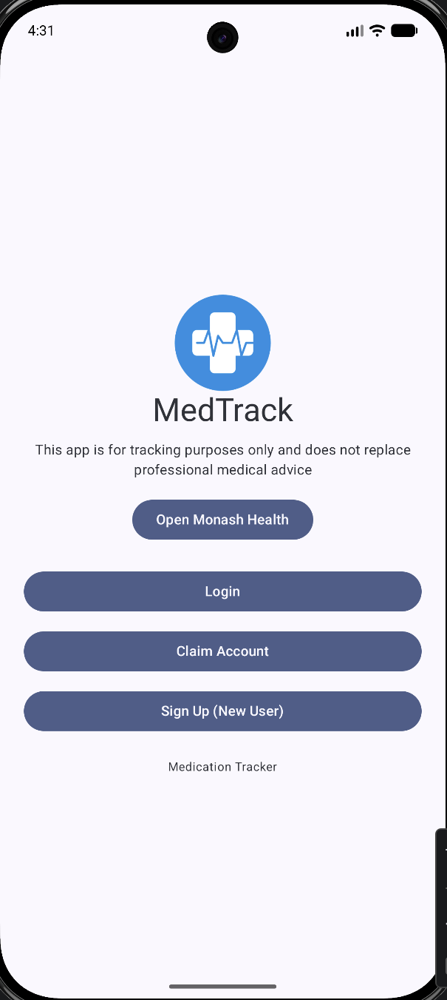
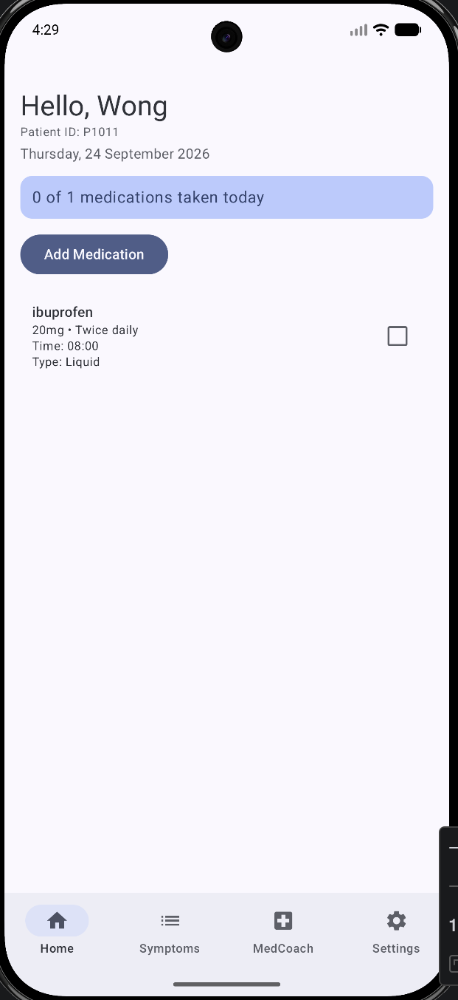
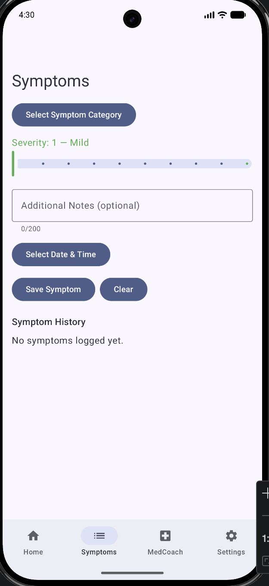
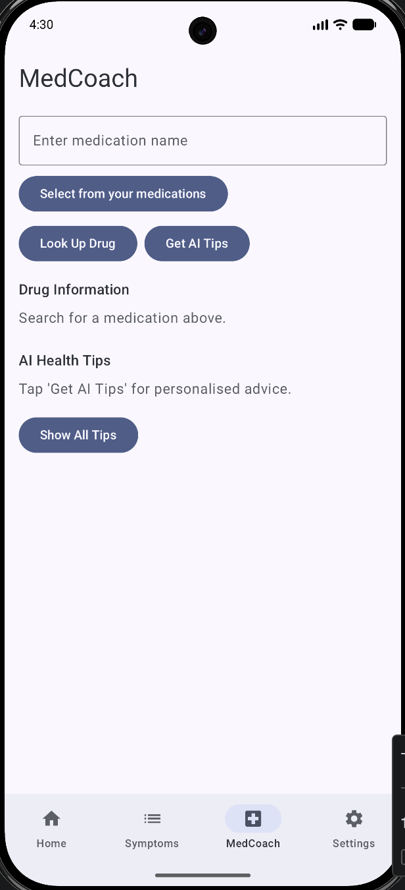
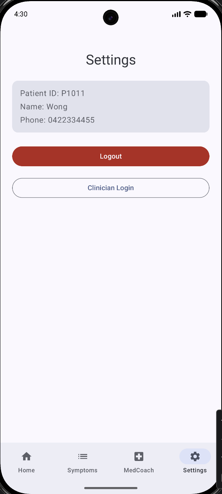

Medication Tracker

Medication Tracker is an Android application designed to help users manage their medications, monitor symptoms, access drug information, and receive medication-related assistance through an intuitive mobile interface.

The application also includes clinician-focused functionality and integrates external services such as OpenFDA for medication information and Google Gemini for AI-powered assistance.

✨ Features
Medication Management - Add and manage medication information in one place.
Medication Reminders — Schedule reminders to support consistent medication routines.
Symptom Tracking — Record and monitor symptoms over time.
Drug Information Search — Retrieve medication information using the OpenFDA API.
AI-Powered MedCoach — Generate medication-related guidance using Google Gemini.
Clinician Dashboard — Provides a dedicated interface for viewing patient-related information.
Patient Accounts — Supports patient login, registration, and account management.
Local Data Storage — Stores application data locally using Room Database.
🛠️ Tech Stack

Language

Kotlin

Android

Jetpack Compose
Android SDK
Material Design

Architecture

MVVM (Model-View-ViewModel)
Repository Pattern

Database

Room Database
SQLite

Networking

Retrofit
OpenFDA API

AI Integration

Google Gemini API

Other

Kotlin Coroutines
Android Notifications
Gradle
🏗️ Architecture

The application follows the MVVM architecture to separate the user interface, application logic, and data layers.

UI (Jetpack Compose)
        │
        ▼
ViewModel
        │
        ▼
Repository
        │
        ├── Room Database
        │
        └── External APIs
              ├── OpenFDA
              └── Google Gemini

This structure helps keep the codebase modular and separates UI logic from data management and external service communication.

📱 Main Components
data/
├── api/            # OpenFDA API and Retrofit configuration
├── dao/            # Room database access objects
├── entity/         # Database entities
└── repository/     # Data repositories

navigation/
├── BottomNavBar
└── Screen

userinterface/
├── HomeScreen
├── AddMedicationScreen
├── SymptomsScreen
├── MedCoachScreen
├── SettingsScreen
├── LoginScreen
└── ClinicianDashboardScreen

viewmodel/
├── MedicationViewModel
├── PatientViewModel
├── SymptomViewModel
└── MedCoachViewModel

util/
├── MedicationReminderReceiver
├── NotificationHelper
└── CsvSeeder
🔌 API Integrations
OpenFDA

The application integrates with the OpenFDA API to retrieve drug information based on medication searches.

Google Gemini

Google Gemini powers the MedCoach functionality and provides AI-generated medication-related assistance.

The Gemini API key is not stored in the repository. It must be configured locally before running the application.

⚙️ Setup
1. Clone the repository
git clone https://github.com/kingsleywlw/Medication-Tracker.git

Open the project in Android Studio.

2. Configure the Gemini API key

Add the following line to your project's local.properties file:

GEMINI_API_KEY=YOUR_GEMINI_API_KEY

local.properties is excluded from Git through .gitignore, preventing the API key from being committed to the repository.

3. Build and run

Sync the Gradle project and run the application using an Android emulator or physical Android device.

📸 Screenshots

Screenshots of the application interface will be added here.

  
  
  
  
  

🔒 Security

Sensitive configuration such as API credentials is kept outside the Git repository using local.properties.

API keys should never be committed directly into source code.

👨‍💻 Author

Kingsley Wong

Computer Science (Data Science)
Monash University

GitHub: @kingsleywlw
